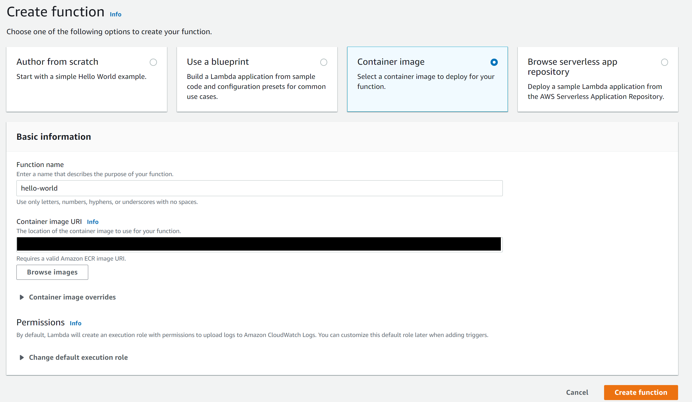
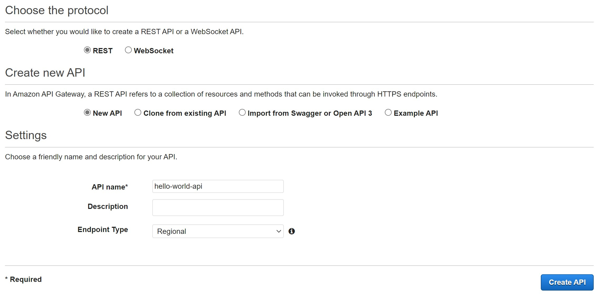
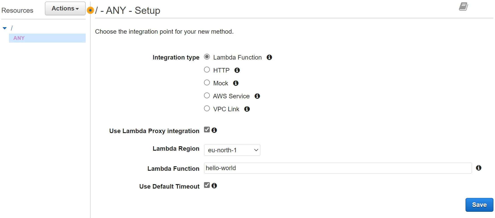
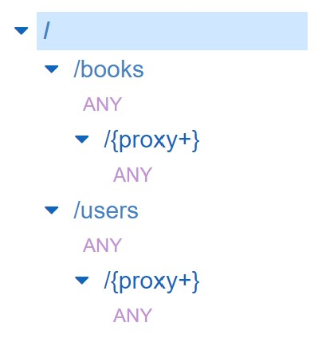

# Demonstration of Deploying Multiple API Servers with Docker and AWS Lambda

# Table of Contents

- [Demonstration of Deploying Multiple API Servers with Docker and AWS Lambda](#demonstration-of-deploying-multiple-api-servers-with-docker-and-aws-lambda)
- [Table of Contents](#table-of-contents)
- [Description](#description)
- [Project Configurations and Framework Used](#project-configurations-and-framework-used)
- [Guide](#guide)
	- [Step 1 - Create a handler for the API Servers to be ran on AWS Lambda](#step-1---create-a-handler-for-the-api-servers-to-be-ran-on-aws-lambda)
	- [Step 2 - Create a Dockerfile for both applications](#step-2---create-a-dockerfile-for-both-applications)
	- [Step 3 - Build the Docker images with `docker-compose`](#step-3---build-the-docker-images-with-docker-compose)
		- [Build the required Java file](#build-the-required-java-file)
		- [Run `docker-compose` to build both Docker image at the same time](#run-docker-compose-to-build-both-docker-image-at-the-same-time)
	- [Step 4 - Deploy the Docker images to AWS ECR](#step-4---deploy-the-docker-images-to-aws-ecr)
		- [Prerequisite](#prerequisite)

# Description

This demonstration would like to show:

- How to dockerize multiple backend API servers (written in different languages) under the same project at the same time with `docker-compose`.

- How to then deploy the docker containers to AWS lambda.

If you want to deploy the servers in a local environment with `docker-compose`, please visit the branch [`local-env-demo`](https://github.com/EDChui/docker-to-aws-demo/tree/local-env-demo).
It is also recommended to visit that branch first before going on. 

# Project Configurations and Framework Used

- Java 11
  - Uses [Spring Boot](https://spring.io/projects/spring-boot) to develop the APIs (`java-book-api`)
- Python 3.9
  - Uses [FastAPI](https://fastapi.tiangolo.com/) to develop the APIs (`python-library-user-api`)

[Docker](https://www.docker.com/) should also be installed.

# Guide

## Step 1 - Create a handler for the API Servers to be ran on AWS Lambda

To deploy an API server to AWS Lambda, a handler must be created such that when an event trigger the Lambda function, the corresponding API endpoint can act correspondingly.

---

For FastAPI, this can be done simply by using [Mangum](https://github.com/jordaneremieff/mangum). All we need to do is to wrap our application with it at the end of `main.py`.

	handler = Mangum(app)

---

For Spring Boot, it is a bit more complicated.

We first need to import the correct dependency to the project and create a handler class which implements `RequestStreamHandler`. 

More details provided by AWS Labs can be found [here](https://github.com/awslabs/aws-serverless-java-container/wiki/Quick-start---Spring-Boot2).

## Step 2 - Create a Dockerfile for both applications

We have to build the Docker images such that they can be uploaded to AWS ECR.

Note that the Dockerfile used in this branch is different from [`local-env-demo`](https://github.com/EDChui/docker-to-aws-demo/tree/local-env-demo).

---

For both Python and Java, we have to use the base image provided by `public.ecr.aws/lambda` and specify the Lambda handler at the end of the file.

For example, in `python-library-user-api`, we can see that we use `CMD ["main.handler"]` in the last line of the Dockerfile. This will be the entry point for Lambda.

And in `java-book-api`, we have used `CMD ["com.example.book.StreamLambdaHandler::handleRequest"]` here.

## Step 3 - Build the Docker images with `docker-compose`

### Build the required Java file

Before running `docker-compose`, we first need to use Gradle to clean and build the required `.jar` files for building a docker image for `java-book-api`.

As in the `/java-book-api/Dockerfile`, we have to copy those `.jar` files for building a Docker Image.

	COPY build/libs/*.jar app.jar

It can be done in IntelliJ under the Gradle Project.

Alternatively, we can configure the `docker-compose.yml` that the service `book` is built from another Dockerfile similar to [this one](https://github.com/EDChui/docker-to-aws-demo/blob/local-env-demo/java-book-api/Dockerfile.noNeedPrebuilt) instead of the provided `Dockerfile` in this branch, then there is no need to preform a Gradle build as the build will be performed when building the Docker image each time. Note that this method will take a longer time for building the Docker image.

### Run `docker-compose` to build both Docker image at the same time

Instead of building the docker images individually with `docker build -t <image_name> .` and 
deploy the servers with `docker run -d --name <container_name> -p <hostPort:containerPort> -e <"envVarKey":"envVarValue"> <image_name>` each time, we can build both images at the same time with `docker-compose`.

We can simply use

	docker-compose -p <project_name> build

to build the images.

## Step 4 - Deploy the Docker images to AWS ECR

### Prerequisite

You should have:

- [Installed AWS CLI](https://docs.aws.amazon.com/cli/latest/userguide/getting-started-install.html),
- [Created an IAM user account and have its access key ID and secret access key](https://docs.aws.amazon.com/cli/latest/userguide/getting-started-prereqs.html), and
- [Configured your AWS CLI](https://docs.aws.amazon.com/cli/latest/userguide/cli-configure-quickstart.html)

--- 

1. Authenticate the Docker CLI to your Amazon ECR registry

	 	aws ecr get-login-password --region <region_name> | docker login --username AWS --password-stdin <your-account-id>.dkr.ecr.<region_name>.amazonaws.com

	Your account ID should looks like `123456789012`. You can copy your account ID from the upper right corner dropdown menu in then AWS console page.

2. Create a repository in Amazon ECR with

		aws ecr create-repository --repository-name <ecr-repository-name> --image-scanning-configuration scanOnPush=true --image-tag-mutability MUTABLE

3. Tag and deploy the image you have built to Amazon ECR

		docker tag <docker_image_name>:latest <your-account-id>.dkr.ecr.<region_name>.amazonaws.com/<docker_image_name>:latest
    
        docker push <your-account-id>.dkr.ecr.<region_name>.amazonaws.com/<docker_image_name>:latest

4. Create a function in AWS Lambda

    

5. Create API in AWS API Gateway

    1. Choose "REST API" as API type.
    2. 
    3. Select "Actions" --> Create Resource
       1. Create one resource with name `books` and the other called `users`
       2. For each resources
          1. Select Method --> Choose "Any"
          2. Check the "Use Lambda Proxy integration"
          3. Select the corresponding Lambda function
          4. 
          5. Select "Actions" --> Create Resource
          6. Check "Configure as proxy resource" --> Create Resource
          7. Select the AWS Lambda function accordingly again.
    4. 
    5. The final structure should be the same as above.

6. Deploy the API in AWS API Gateway

    1. Select Actions in the API that just have created.
    2. Select "Deploy API".
    3. Select "[New Stage]" as Deployment stage.
    4. Give a name to the new stage, e.g. `dev`.
    5. It will generate a URL that can use the endpoint of the API.

7. Set up environment variables in AWS Lambda

Under the Lambda function for the library user, an environment variable `BOOK_API_BASE_URL` has to be set up.

	1. Go to the corresponding function.
	2. Select configuration.
	3. Add the environment variable accordingly with the base URL in API Gateway.