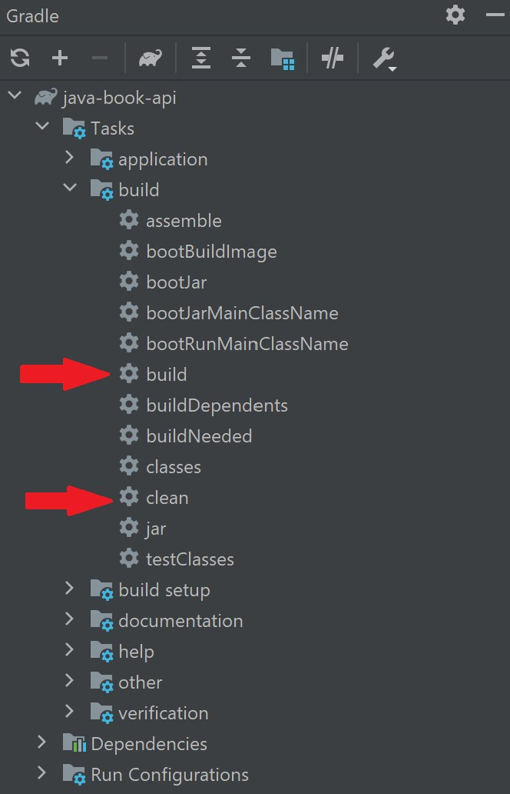

# Demonstration of Deploying Multiple API Servers with Docker and AWS Lambda

# Table of Content

- [Demonstration of Deploying Multiple API Servers with Docker and AWS Lambda](#demonstration-of-deploying-multiple-api-servers-with-docker-and-aws-lambda)
- [Table of Content](#table-of-content)
- [Description](#description)
- [Project Configurations](#project-configurations)
- [Guide](#guide)
	- [Step 1 - Clean & Build the required Java file for Building a Docker Image](#step-1---clean--build-the-required-java-file-for-building-a-docker-image)
	- [Step 2 - Run `docker-compose`](#step-2---run-docker-compose)
		- [Details of `docker-compose.yml`](#details-of-docker-composeyml)

# Description

The purpose of this branch is to demonstrate how to use `docker-compose` to build and deploys multiple API servers in a local environment at the same time.

# Project Configurations

- Java 11
  - Uses [Spring Boot](https://spring.io/) to develop the APIs (`java-book-api`)
- Python 3.9
  - Uses [FastAPI](https://fastapi.tiangolo.com/) to develop the APIs (`python-library-user-api`)

[Docker](https://www.docker.com/) should also be installed.

# Guide

## Step 1 - Clean & Build the required Java file for Building a Docker Image

We first need to clean and build the required `.jar` files for building a docker image for the `book` APIs.

As in the `/java-book-api/Dockerfile`, we have to copy those `.jar` files for building a Docker Image.

	COPY build/libs/*.jar app.jar

It can be done in IntelliJ under the Gradle Project.

## Step 2 - Run `docker-compose`

Instead of building the docker images individually with `docker build -t <image_name> .` and 
deploy the servers with `docker run -d --name <container_name> -p <hostPort:containerPort> -e <"envVarKey":"envVarValue"> <image_name>`, we can build and deploy both servers at the same time with `docker-compose`.

We can simply use

	docker-compose -p <project_name> up -d

to build and deploy the images and run both servers locally.

### Details of `docker-compose.yml`

In this file, we have defined 2 services, `book` and `library_user`.

Note that we can specify the container name with `container_name` and how shall the Docker image be built under the `build` session.

The `ports` specify what is the port to make request to the corresponding server.

In this demonstration, for example, `localhost:8080` is for the book APIs and `localhost:8090` is for the user APIs.

In the `library_user` service, there is a `depends_on` session. This part tell `docker-compose` to build `book` first before `library_user` service.

The `environment` are the environment variables used by the service. In this demonstration, the `library_user` will first make a request to `book` to get a random book in `POST /users/{id}/books/random`.

The `links` allow the communication between the containers.
