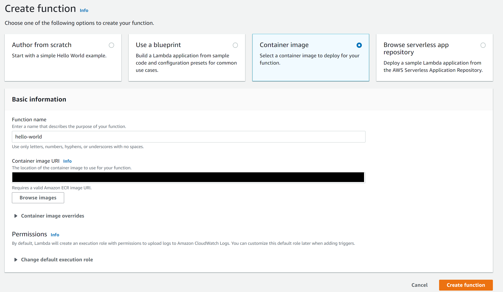
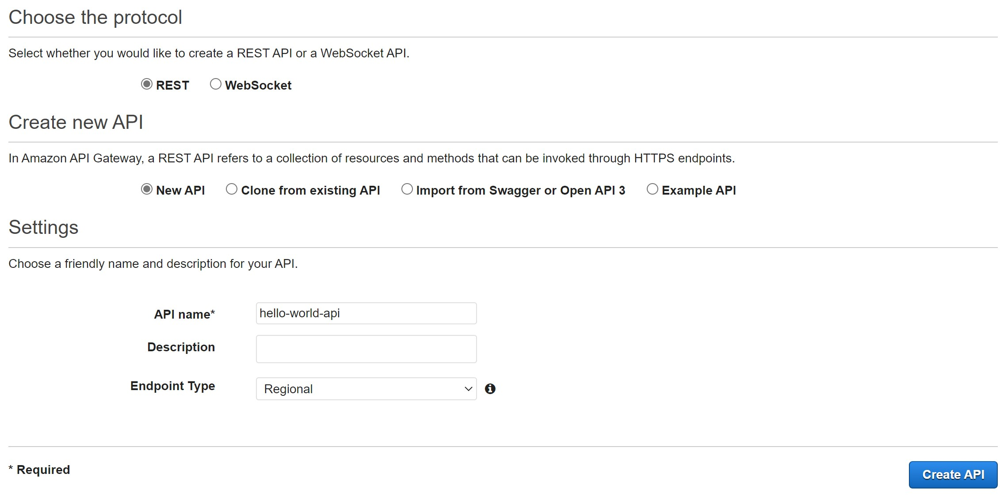
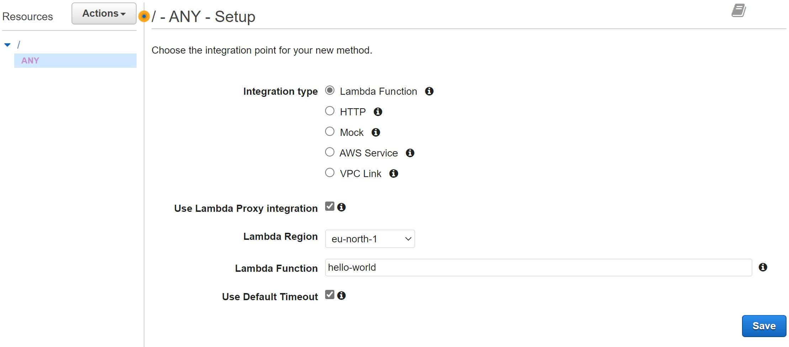

# 1. Python Library User API

## 1.1. Table of Content

- [1. Python Library User API](#1-python-library-user-api)
  - [1.1. Table of Content](#11-table-of-content)
  - [1.2. Individually Deploying this API to AWS Lambda](#12-individually-deploying-this-api-to-aws-lambda)
    - [1.2.1. Prerequisite](#121-prerequisite)
    - [1.2.2. Build the Docker Image](#122-build-the-docker-image)
  - [1.3. API Lists](#13-api-lists)
    - [1.3.1. Add Users](#131-add-users)
    - [1.3.2. Get All Users](#132-get-all-users)
    - [1.3.3. Get User by ID](#133-get-user-by-id)
    - [1.3.4. Delete User by ID](#134-delete-user-by-id)
    - [1.3.5. Add Book to User](#135-add-book-to-user)


## 1.2. Individually Deploying this API to AWS Lambda

### 1.2.1. Prerequisite

You should have:

- [Installed AWS CLI](https://docs.aws.amazon.com/cli/latest/userguide/getting-started-install.html),
- [Created an IAM user account and have its access key ID and secret access key](https://docs.aws.amazon.com/cli/latest/userguide/getting-started-prereqs.html), and
- [Configured your AWS CLI](https://docs.aws.amazon.com/cli/latest/userguide/cli-configure-quickstart.html)

### 1.2.2. Build the Docker Image

Reference:
- https://docs.aws.amazon.com/lambda/latest/dg/images-create.html
- https://medium.com/analytics-vidhya/python-fastapi-and-aws-lambda-container-3e524c586f01

1. Build the docker image with

        docker build -t <docker_image_name> .

2.  Authenticate the Docker CLI to your Amazon ECR registry

        aws ecr get-login-password --region <region_name> | docker login --username AWS --password-stdin <your-account-id>.dkr.ecr.<region_name>.amazonaws.com    

    Your account ID should looks like `123456789012`. You can copy your account ID from the upper right corner dropdown menu in then AWS console page.

3. Create a repository in Amazon ECR with

        aws ecr create-repository --repository-name <ecr-repository-name> --image-scanning-configuration scanOnPush=true --image-tag-mutability MUTABLE

4. Tag and deploy the image you have built to Amazon ECR

        docker tag  <docker_image_name>:latest <your-account-id>.dkr.ecr.<region_name>.amazonaws.com/<docker_image_name>:latest
    
        docker push <your-account-id>.dkr.ecr.<region_name>.amazonaws.com/<docker_image_name>:latest

5. Create a function in AWS Lambda

    

6. Create API in AWS API Gateway

    1. Choose "REST API" as API type.
    2. 
    3. Select "Actions" --> Create Method --> Choose "Any"
       1. Check the "Use Lambda Proxy integration"
       2. 
    4. Select "Actions" --> Create Resource
       1. Check "Configure as proxy resource" --> Create Resource
       2. Select the AWS Lambda function accordingly.

7. Deploy the API in AWS API Gateway

    1. Select Actions in the API that just have created.
    2. Select "Deploy API".
    3. Select "[New Stage]" as Deployment stage.
    4. Give a name to the new stage, e.g. `dev`.
    5. It will generate a URL that can use the endpoint of the API.

## 1.3. API Lists

### 1.3.1. Add Users

Method

	POST

Endpoint

	/users

Payload

```json
{
	"name": "Danny"
}
```

Response

```json
{
	"id": 3
}
```

### 1.3.2. Get All Users

Method

	GET

Endpoint

	/users

Response

```json
{
    "0": {
        "name": "Alice",
        "books": [
            {
                "isbn": "1234567",
                "name": "A new book",
                "author": "It's me"
            }
        ]
    },
    "1": {
        "name": "Bob",
        "books": []
    },
    "2": {
        "name": "Cindy",
        "books": []
    },
    "3": {
        "name": "Danny",
        "books": []
    }
}
```

### 1.3.3. Get User by ID

Method

	GET

Endpoint

	/users/{id}

Response

```json
{
    "name": "Alice",
    "books": [
        {
            "isbn": "1234567",
            "name": "A new book",
            "author": "It's me"
        }
    ]
}
```

### 1.3.4. Delete User by ID

Method

	DELETE

Endpoint

	/users/{id}

Response

```json
{
	"success": true
}
```

### 1.3.5. Add Book to User

Method

	POST

Endpoint

	/users/{id}/books

Payload

```json
{
    "isbn": "1234567",
    "name": "A new book",
    "author": "It's me"
}
```

Response
```json
{
	"success": true
}
```